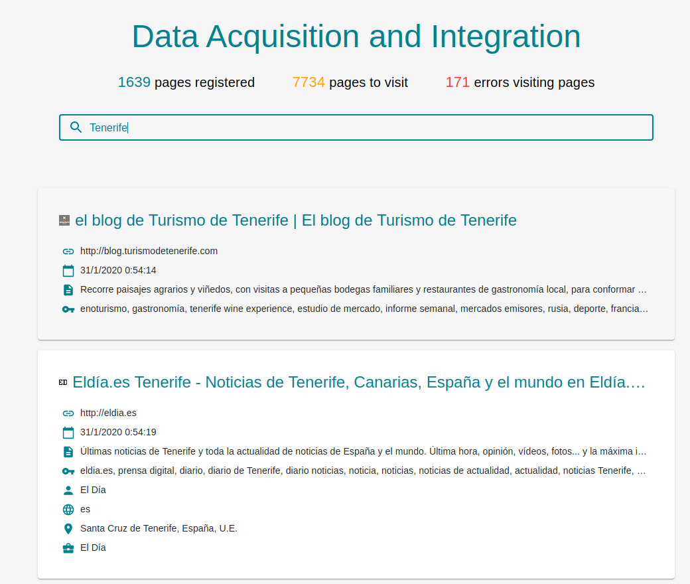

# BrowserClient

React application which allows users to search information about webpages. The searches are sent to **/search** [BrowserServer](https://github.com/DauteRR/BrowserServer)'s endpoint when the users modifies the value stored in the search bar. [BrowserClient](https://github.com/DauteRR/BrowserClient) alse makes GET petitions periodically to **/ping** [BrowserServer](https://github.com/DauteRR/BrowserServer)'s endpoint to obtain information about the amount of documents stored on each database collection. The information about the webpages is retrieved using [WebScraper](https://github.com/DauteRR/WebScraper). [BrowserClient](https://github.com/DauteRR/BrowserClient) was created as a part of the final project of Data Acquisition and Integration subject.

<div style="text-align:center;height:500px"></div>

When a search is performed, the web application displays one card for each page registered. The card will show the information acquired when registering the webpage with [WebScraper](https://github.com/DauteRR/WebScraper):

- Title
- Url
- Registry timestamp
- Description
- Keywords
- Author
- Language
- Locality
- Organization

By default, [BrowserServer](https://github.com/DauteRR/BrowserServer) limits the results to 100 webpages. The search of the webpages is made using _\$text_ _MongoDB_ query operator and the results are sorted using _textScore_. To be able to perform the searches it was necessary to add a text type index on several fields of the _visited_ collection. Each index field has a weight assigned:

- _title_: 10
- _meta_
  - _keywords_: 5
- _headers_:
  - _h1_: 3
  - _h2_: 2
- _content_: 1

## Usage

To start the application run the comands below:

```bash
$ yarn
$ yarn start
```

or

```bash
$ npm i
$ npm start
```

After running the previous commands the web application can be tested accessing to localhost:3000. Note that for correct usage it is necessary to start [BrowserServer](https://github.com/DauteRR/BrowserServer).

## About the project

<div style="text-align:center;"></div>

With [BrowserClient](https://github.com/DauteRR/BrowserClient), users are able to search information about registered webpages. The petitions made by [BrowserClient](https://github.com/DauteRR/BrowserClient) are resolved by [BrowserServer](https://github.com/DauteRR/BrowserServer). Webpages information is stored in a _MongoDB_ database using [WebScraper](https://github.com/DauteRR/WebScraper). The database has 3 collections:

- **visited**: Stores information about visited webpages
  - _title_: Webpage title
  - _meta_: Information extracted from webpages meta tags
    - _keywords_
    - _description_
    - _author_
    - _lang_
    - _locality_
    - _organization_
  - _content_: Filtered webpage content
  - _headers_: Webpage headers
  - _lastVisited_: Timestamp
  - _url_: Webpage url
  - _baseDomain_: Flag indicating if the url corresponds to a base domain
- **notVisited**: Stores information about the webpages to be visited
  - _url_: Webpage url
  - _depth_: Recursivity depth, obtained during the document registry process
  - _baseDomain_: Flag indicating if the url corresponds to a base domain
- **error**: Stores information about webpages that were not stored due to an error
  - _lastVisited_: Timestamp
  - _url_: Webpage url
  - _baseDomain_: Flag indicating if the url corresponds to a base domain
  - _errorType_: Error type
  - _message_: Error message

### Setup

To initialize the database it is necessary to execute [WebScraper](https://github.com/DauteRR/WebScraper) specifying -i or --initialize option:

```bash
$ python3 src/main.py --initialize
```

Once the database is initialized, it is possible to start using [WebScraper](https://github.com/DauteRR/WebScraper) for retrieve webpages information. For more details, see README.md file in [WebScraper](https://github.com/DauteRR/WebScraper) repository.

After obtaining and storing information, it's time to start [BrowserServer](https://github.com/DauteRR/BrowserServer). For more information, visit [BrowserServer](https://github.com/DauteRR/BrowserServer) repository and check README.md file.

In order to perform searches it is necessary to start [BrowserClient](https://github.com/DauteRR/BrowserClient) web application as showed below.
